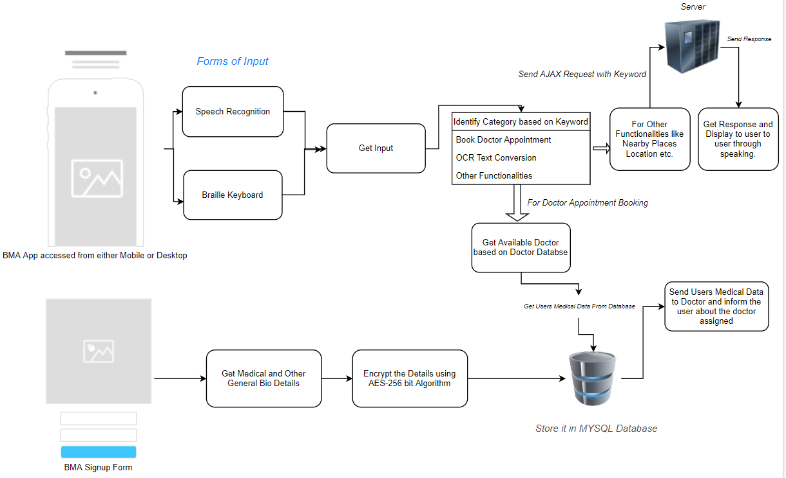
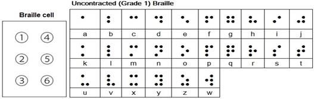
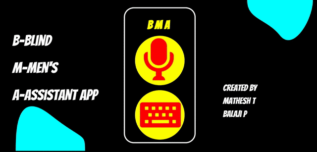
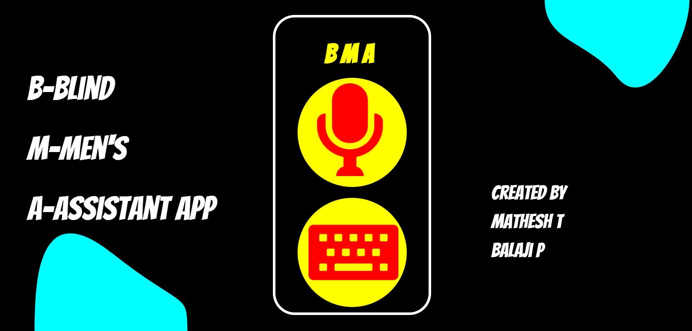
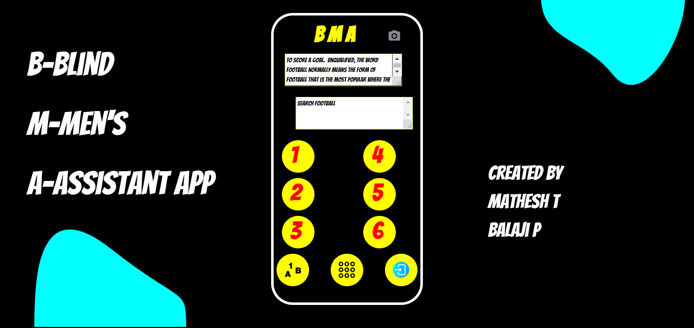
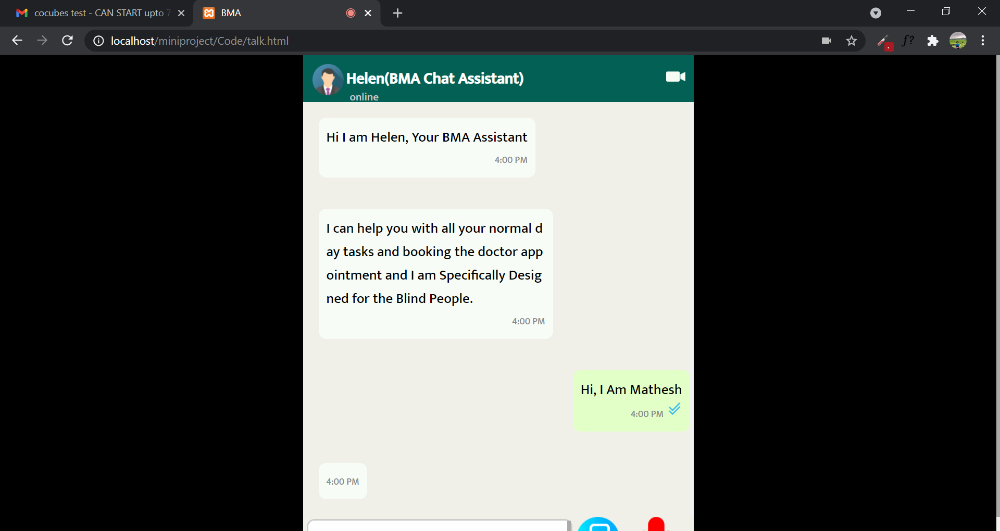
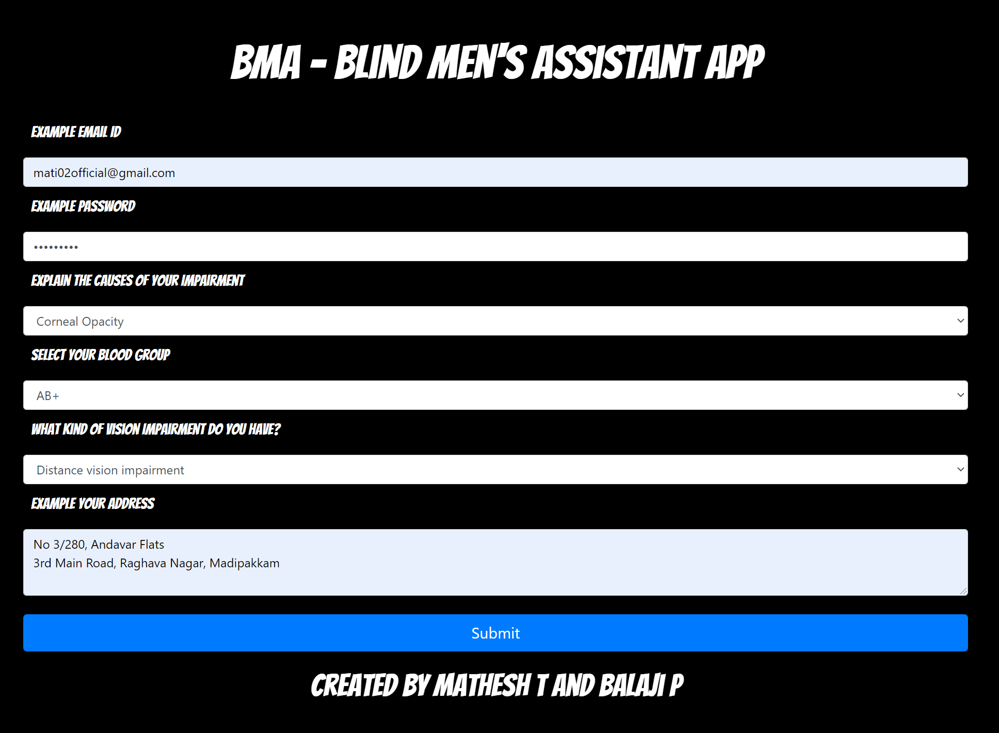

# BMA

BMA is chatbot desinged specifically for Blind people.
The chatbot gets the input through the traditional speech or through keyboard along with blind user specific braille keyboard.

# Architecture Diagram

***Architecture Diagram of BMA*

# Working Procedure of Braille Keyboard

***Braille Keyboard Use case diagram*

***Braille Pattern*

    
  Braille Keyboard works by getting the key value from the button user clicks and storing those patterns temporarily in the client side. 
  

    //Code for Matching the Braille Keyboard Pattern
    function braille_converter()
    {
    var  braille_value  =  localStorage.getItem("key_value");
    var  x=localStorage.getItem("braille_value");
    if(x=="alphabet")
    {
    switch(parseInt(braille_key_value))
    {
    case  1:
        braille_letter="A";
        //... upto case Z
    }
    }
    else
    {
    switch(parseInt(braille_key_value))
    {
    case  1:
        braille_number=1;
        //... upto case 0
    }
    }
    }

After the user presses the submit button the BMA uses a regex expression to understand the pattern from the predefined keywords and produce outputs.

  

    // Code for Matching the Input with category using RegExp
    <script>
    const category=["keyword1","keyword2",..]
    const op=new  RegExp(category.join("|")).test(input)
    <script>

# Functions BMA can Perform

 - Gather user's basic medical details and store it securely using AES hashing Algorithm.
 - Book Doctor Appointments by sending your medical data to  the doctor.
 - Extract OCR text using Tesseract Library
 - Get General Info From Wikipedia
 - Get Nearby Places Location
 - Make a call
 
 

# Screenshots

***Braille Keyboard Working Pattern*

***BMA Index Page*

***Braille Screen*

***BMA Speech Recongnition Page*

***BMA Login Page*

